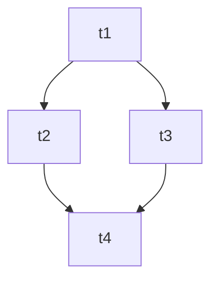

# Task Execution Protocol (Plan / Task / Orchestrator)

## Status

- Date: `2026-05-20`
- Status: adopted, **opt-in**. See `docs/plans/README.md` for the opt-in trigger and the AI suggestion heuristic.

## Purpose

Define how a multi-step change is decomposed into a plan, executed as parallel PRs by subagents, reviewed, and audited — without the human having to micro-manage dispatch.

Scope boundary:
- This doc owns the orchestration mechanics.
- App/product specs are owned by `docs/specs/**` (entrypoint: `AGENTS.md`).
- Local worktree contract is owned by `docs/specs/12-worktree-config-and-isolation.md`.
- Testing strategy and quality gates are owned by `docs/specs/06-testing-strategy.md` and `docs/specs/04-ai-development-playbook.md`.

## Core idea

A **plan** (markdown file with goal, DAG, task cards) is executed by one **coordinator** (Claude in-session) dispatching three kinds of **subagents** in isolated worktrees: **builders**, **reviewers**, and a final **audit**.

State splits cleanly: the plan markdown owns _what to build_; GitHub PRs own _execution lifecycle_. No status fields in markdown.

## Roles

- **Coordinator** — Claude in the active session. Reads plan + GitHub state each iteration, dispatches ready work, surfaces blockers, runs audit at the end. Never merges.
- **Builder** — subagent in a worktree. Takes one task card, ships a PR.
- **Reviewer** — subagent in a worktree. Takes one open PR, approves or returns concrete changes against the card's outcomes.
- **Audit** — subagent, runs once at the end. Verifies plan-level outcomes (not just per-task contracts).

All subagents run with `isolation: "worktree"` (Claude Code Agent tool option). The worktree harness provides the isolated checkout — subagents must NOT call `./scripts/worktree-create.sh` themselves.

## Task types

Same card template, two output shapes:

- **Build task** — ships a PR with code, tests, docs.
- **Design / research task** — ships a PR landing a design doc under `docs/plans/<plan-name>/designs/<task-id>.md`, refines downstream cards, and/or updates persistent docs in `docs/specs/**`. Use when uncertainty would poison build tasks; resolve as a first-class step, then downstream tasks are clear.

## Plan layout

```
docs/plans/<plan-name>/
  plan.md            entry point
  designs/           optional — design/research task outputs
  tasks/             optional — extracted task cards if they outgrow inline form
```

`plan.md` skeleton:

````markdown
# Plan: <name>

## Goal

One paragraph: what this plan achieves.

## Outcomes

What "done" looks like at the plan level — observable, specific.

## Orchestration

- Status: enabled
- Plan slug (for PR filtering): `<plan-slug>`
- Builder concurrency cap: 4
- Reviewer concurrency cap: unbounded
- Deviations from default protocol: _(none / list)_

## DAG



## Tasks

### t1: <title>

…

### t2: <title>

…

## Deviations log

_(empty until first merge)_
````

The DAG is the single source of truth for dependencies — task cards do NOT repeat them.

## Task card template

```markdown
### <task-id>: <title>

**Problem:** what's the issue and why it matters.

**Outcomes:** specific, observable things that must be true after this lands.

**Out of scope:** explicit boundaries — what this task does NOT cover.
```

- `<task-id>` is short and stable (`t1`, `auth-init`). Used in PR titles.
- Builders read the whole plan directory — no need to duplicate context on the card.
- The PR-body "Standard checklist" (below) is fixed by this doc; task cards do not restate it.

## Lifecycle

```
pending  ──(coordinator dispatches builder)──▶  open
open     ──(reviewer: approve)─────────────────▶  approved
open     ──(reviewer: request-changes)────────▶  open (builder re-dispatched)
approved ──(human merges)──────────────────────▶  merged
```

State is derived from GitHub every iteration. Because builder and reviewer commit as the same GitHub user, GitHub blocks self-approve/request-changes; reviewers post a **comment review** whose body's first line is the verdict.

A reviewer review is **fresh** when its `submittedAt` is newer than the PR's latest commit `committedDate`. Stale reviews are ignored.

| GitHub observation | Task state |
| --- | --- |
| No PR with title `[<id>] …` | pending |
| PR open; no fresh `[reviewer]` review | ready for review |
| Fresh `[reviewer]` review first line: `Verdict: CHANGES_REQUESTED` | needs re-dispatch |
| Fresh `[reviewer]` review first line: `Verdict: APPROVED` | approved (human to merge) |
| PR closed and merged | merged |

## GitHub protocol

### Access

This environment has **no `gh` CLI**. All GitHub interactions go through the GitHub MCP server (`mcp__github__*`), which is scoped to `dinoderek/boga3`. Subagents use the same MCP tools; pushing branches still uses `git push -u origin <branch>` via Bash.

| Action | MCP tool | Notes |
| --- | --- | --- |
| List PRs in the plan | `mcp__github__list_pull_requests` | Filter client-side on title prefix `[<task-id>]` or contains `<plan-slug>`. |
| Read PR details, reviews, commits | `mcp__github__pull_request_read` | Pass `method: "get"`, `"getReviews"`, `"getComments"`, `"getFiles"`, etc. |
| Open a PR | `mcp__github__create_pull_request` | Builder, after `git push -u origin <branch>`. |
| Update a PR (title, body) | `mcp__github__update_pull_request` | Coordinator may use to fix up titles missing `[<task-id>]`. |
| Post review verdict | `mcp__github__pull_request_review_write` | Reviewer. Use `event: "COMMENT"` (NOT `APPROVE`/`REQUEST_CHANGES` — same-identity restriction). Body's first line is the verdict. |
| Add a coordinator/builder comment | `mcp__github__add_issue_comment` | For `[coordinator]` dispute notes, `[builder]` deviation summaries if needed beyond the PR body. |

### PR conventions

- **PR title:** `[<task-id>] <task title>`.
- **PR body — four sections, in order:**

  ```markdown
  ## Summary

  One paragraph: what shipped and why.

  ## Outcomes

  - [ ] <outcome 1 from the card>
  - [ ] <outcome 2 from the card>

  ## Standard checklist

  - [ ] `./scripts/quality-fast.sh` passes locally (per `docs/specs/04-ai-development-playbook.md`)
  - [ ] `./scripts/quality-slow.sh <area>` posture declared (passed or `N/A`)
  - [ ] Tests added/updated per `docs/specs/06-testing-strategy.md`
  - [ ] UI docs maintenance rules followed per `docs/specs/ui/README.md` (UI tasks only; otherwise `N/A`)
  - [ ] `RUNBOOK.md` reviewed; updated in-session if operator-facing behavior changed

  ## Deviations from card

  _(empty if none — otherwise, one line per deviation)_
  ```

- **Builder ready signal:** opening the PR. No separate comment.
- **Reviewer verdict:** `mcp__github__pull_request_review_write` with `event: "COMMENT"`. First line of body MUST be `Verdict: APPROVED` or `Verdict: CHANGES_REQUESTED`. Subsequent lines reference each unmet outcome / unchecked item.
- **Identity:** all agents commit as the user. Role encoded in:
  - PR-comment prefixes: `[builder]`, `[reviewer]`, `[coordinator]`.
  - Commit trailers (optional but encouraged): `Builder-Agent: <task-id>`, `Reviewer-Agent: <task-id>`.
- **Branch names** are whatever the worktree harness generates; the PR title carries the task id.
- **Expected harness security warning:** reviewer subagent posting on a PR opened by a different (builder) subagent triggers a benign warning — coordinator ignores it as long as the MCP call succeeded.

## Concurrency

- Builders: **≤ 4 in flight**. Coordinator queues excess.
- Reviewers: **unbounded**.
- Coordinator: **one** (Claude). Iterations sequential.

## Quality gates

Builders run `./scripts/quality-fast.sh` directly inside their worktree before opening their PR. The PR's Standard checklist reflects that pass; a failed local gate run blocks the PR.

This is made possible by the `WorktreeCreate` hook at `.claude/hooks/create-worktree.sh`, which overrides the Claude Code Agent harness's default worktree placement. Without the hook, the harness places worktrees at `<project>/.claude/worktrees/agent-<id>/`, which is nested inside the BOGA checkout and trips `boga_validate_worktree_placement` in `scripts/worktree-lib.sh`. With the hook, worktrees land at `$HOME/.cache/boga-agent-worktrees/<branch>/` (override via `BOGA_AGENT_WORKTREE_ROOT`) — outside the BOGA checkout, with their own `.worktree-slot` and their own isolated `apps/mobile/node_modules` install. The hook contract follows https://code.claude.com/docs/en/hooks.md#worktreecreate: stdin receives the harness's JSON envelope (`session_id`, `cwd`, …) and stdout returns the absolute worktree path.

The hook is registered in `.claude/settings.json` under `hooks.WorktreeCreate`. Setup is one-time per worktree; each builder dispatch incurs the `npm ci` cost (typically ~20s with a warm npm cache, up to ~90s cold) so dependencies are fully isolated per the "worktrees share nothing" contract.

The coordinator does not need to mirror the gate run from `main`; the builder's PR body asserts the gates pass, and reviewers reject PRs whose CI fails.

## Deviations

A deviation is anything the builder did differently from the card. Builders log them in the PR body's `## Deviations from card` section. After each merge, the coordinator:

1. Appends to plan's `## Deviations log`: `- <task-id> (PR #N): <one-line summary>`.
2. Updates pending task cards the deviation affects, inline, prefixed `> Updated from <merged-id>: …`.
3. **Does NOT edit in-flight cards** (builder already loaded the old contract). Instead, appends a follow-up task to the plan + DAG edge.

## Disputes

If a reviewer requests changes **twice** on the same PR without converging:

1. Coordinator stops re-dispatching the builder.
2. Posts a `[coordinator]` comment summarising the disagreement.
3. Surfaces the PR to the human in the next status message. Human resolves.

## Audit

Runs once, after every task is merged. Single subagent. Checks:

- Plan-level outcomes achieved end-to-end (against the plan's `## Outcomes` section).
- Documentation reflects new state — for UI tasks, per `docs/specs/ui/README.md` maintenance rules; for cross-cutting changes, per the `AGENTS.md` always-load list.
- Quality gates pass on the integration branch: `./scripts/quality-fast.sh` and any declared `./scripts/quality-slow.sh <area>` postures.
- Deviations compose coherently — no dropped outcomes.

**Pass:** coordinator deletes the plan directory. **Fail:** audit appends remediation cards + DAG edges; orchestration resumes.

## Coordinator loop (event-driven)

Each iteration:

1. **Refresh state.** First invocation: read `plan.md`. Subsequent: re-read only if previous iteration edited cards. Always query GitHub for all task PRs in the plan via `mcp__github__list_pull_requests` + client-side filter on the plan slug / `[<task-id>]` prefix.
2. **Process newly-merged PRs.** Update deviations log, affected pending cards, queue follow-ups for affected in-flight tasks.
3. **Identify ready work.** Pending tasks with all DAG deps merged; open PRs without a fresh reviewer review.
4. **Dispatch in parallel** — one assistant message with multiple `Agent` tool calls (up to 4 builders, unbounded reviewers). All with `isolation: "worktree"`.
5. **Wait for the batch.** `Agent` blocks until subagents return — that completion IS the event.
6. **Decide next.** More work and no human action needed → loop to step 1 in the same turn. Otherwise surface human-action items and end the turn.

**Resumption.** Human responds (replied to nudge, merged PR, or started new chat with `execute plan at docs/plans/<plan-name>/`) → coordinator picks up at step 1. New session = fresh re-read of `plan.md`.

**No autonomous merge.** Coordinator never calls `mcp__github__merge_pull_request`.

**Silent builder failure watch.** If a builder returns without opening a PR, the task looks `pending` next iteration and gets re-dispatched. Twice on the same task → treat as dispute.

## Subagent prompting

Builders and reviewers don't see the chat history. The coordinator's `Agent` prompt must:

- Point to the plan directory: `docs/plans/<plan-name>/`.
- Name the specific task card by id.
- For builders: list the critical file paths from the card (with line numbers when relevant), state the working branch is the worktree's auto-generated branch, and require the four-section PR body.
- For reviewers: pass the PR number, the card id, and the verdict-format requirement.
- Tell the subagent which `mcp__github__*` tools to use; they may need to load schemas via `ToolSearch` first (these tools are typically deferred at session start).

## Invocation

The coordinator enters orchestrator mode only on an explicit user message:

```
execute plan at docs/plans/<plan-name>/
```

After that one message, the human's role is: merge approved PRs, resolve disputes, resume in a new chat if the session ends. See `docs/plans/README.md` for the opt-in trigger and the AI suggestion heuristic that governs when to propose this protocol in the first place.
