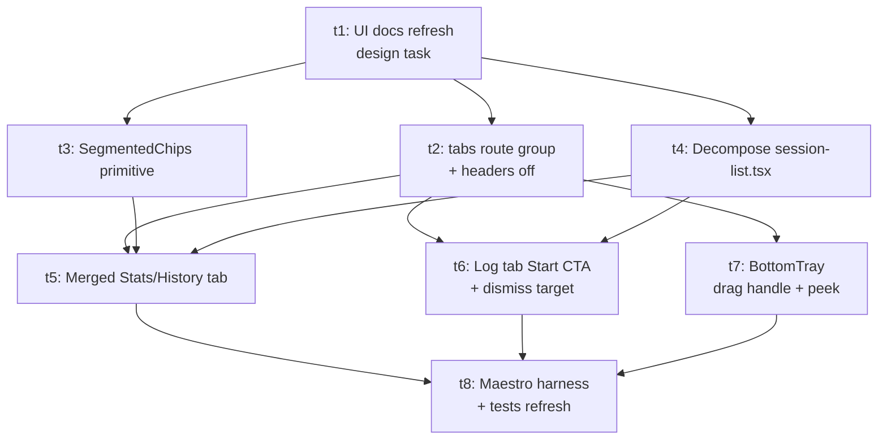

# Plan: navigation-redesign

## Goal

Replace today's `Sessions / Exercises / Stats / ⚙` navigation in `apps/mobile` with a re-themed three-tab layout — **Stats/History → Log → Exercises** — plus a Settings cog, all hosted inside a hideable bottom tray. Merge stats and session history into one tab with a segmented toggle; elevate session recording to a permanent destination with an empty-state Start CTA; reclaim vertical space by hiding the native stack header on tab roots; lay structural groundwork for a future Exercises section without building it yet.

## Outcomes

- Three permanent tabs render in the bottom tray in order **Stats/History → Log → Exercises**, with a Settings cog as a utility action on the right (not a fourth tab).
- The Stats/History tab has a top segmented control switching between `Stats` and `History` views, each preserving its own scroll/state across tab switches.
- The Log tab renders the recorder when an active session exists; otherwise renders an empty state with a single primary `Start Session` button that creates a session and reveals the recorder body.
- The bottom tray can be collapsed via the drag handle into a peek strip; swipe/tap on the peek restores it. State does not need to persist across app restarts.
- The native stack header is hidden on every tab root; detail screens (`completed-session/[sessionId]`, `profile`, `session-recorder?mode=completed-edit`, `maestro-harness`) keep a light back-affordance header.
- The `/session-recorder` URL is preserved so `apps/mobile/src/sync/scheduler.ts:6` (`SESSION_RECORDER_ROUTE_SEGMENT`) needs no change and the recorder sync cadence still flips correctly.
- `apps/mobile/src/maestro/harness.ts` `'session-list'` teleport target returns `/stats-history` (history view) and the existing maestro smoke + data-smoke flows pass.
- `docs/specs/ui/screen-map.md`, `navigation-contract.md`, `ux-rules.md`, and `components-catalog.md` describe the new state and are consistent with the code.
- `./scripts/quality-fast.sh` and `npm test --workspace apps/mobile` pass on the integration branch.

## Orchestration

- Status: enabled
- Plan slug (for `mcp__github__list_pull_requests` filter): `navigation-redesign`
- Builder concurrency cap: 4
- Reviewer concurrency cap: unbounded
- Deviations from default protocol: none

## DAG

## Tasks

### t1: Refresh UI docs to describe new navigation contract

**Problem:** `docs/specs/ui/screen-map.md`, `navigation-contract.md`, `ux-rules.md`, and `components-catalog.md` describe today's `sessions / exercises / stats / ⚙` layout. Builders for t2–t8 need the future-state contract documented before writing code, so design intent and route/component contracts cannot drift task-by-task.

**Outcomes:**
- All four UI docs reflect the target design: three tabs (`stats-history`, `log` at `/session-recorder`, `exercises` at `/exercise-catalog`) plus Settings cog; segmented `Stats` ↔ `History` view inside the Stats/History tab; recorder empty state with a Start CTA; hideable bottom tray with drag handle + peek strip; native stack header hidden on tab roots.
- `navigation-contract.md` records the preserved `/session-recorder` URL and the updated dismiss target (`/stats-history`) for the recorder.
- `components-catalog.md` adds entries for the planned `BottomTray` and `SegmentedChips` primitives and updates `TopLevelTabs` to the new three-tab + cog API.
- PR lands docs-only with no code changes.

**Out of scope:** code edits anywhere under `apps/mobile/**`; any spec doc outside `docs/specs/ui/**`; introducing a sub-nav inside the Exercises tab (documented as future direction only).

### t2: Introduce `(tabs)` route group and turn off the top header on tab roots

**Problem:** Today's routes live at `apps/mobile/app/{stats,session-list,session-recorder,exercise-catalog,settings}.tsx` under a single Stack with default headers, and each tab screen re-mounts `TopLevelTabs` itself. The new design requires a shared tabs layout, a redirect for the deprecated `/session-list` path, and `headerShown: false` on tab roots — but no behavior change yet.

**Outcomes:**
- `apps/mobile/app/(tabs)/_layout.tsx` exists and renders a Tabs layout that owns the bottom tray. Tab roots are moved into `(tabs)/`: `stats-history.tsx` initially rendering today's stats body verbatim, `session-recorder.tsx` (moved), `exercise-catalog.tsx` (moved). `settings.tsx` stays reachable via the cog rendered inside the custom tray and lives at `app/(tabs)/settings.tsx` (path `/settings` preserved).
- `apps/mobile/app/_layout.tsx` declares only `(tabs)`, the detail screens (`completed-session/[sessionId]`, `profile`, `maestro-harness`), and a redirect stub for `session-list`. Tab roots run with `headerShown: false`; detail screens keep their titles.
- `apps/mobile/app/session-list.tsx` becomes a thin redirect to `/stats-history` (so `apps/mobile/src/maestro/harness.ts:76` keeps working until t8 updates it).
- `apps/mobile/app/index.tsx` redirects to `/stats-history`.
- The `/session-recorder` URL stays intact and `apps/mobile/src/sync/scheduler.ts` does not need changes.
- Each tab screen no longer renders `<TopLevelTabs>` itself; the existing four-arg component continues to compile (renamed/reshaped in t7).

**Out of scope:** the segmented `Stats` ↔ `History` toggle (t5); the History view body in the Stats/History tab (t5); the Log tab empty-state Start CTA (t6); the `BottomTray` drag-handle behavior (t7); the `SegmentedChips` primitive (t3); the `TopLevelTabs` shape change (t7); maestro/test refresh (t8).

### t3: Extract `SegmentedChips` UI primitive

**Problem:** `apps/mobile/app/stats.tsx:104-122` defines a chip-row pattern (period selector) that the new Stats/History view toggle (t5) will reuse conceptually. Today the styling and behavior are inlined — extracting it as a UI primitive avoids drift and keeps the toggle visually consistent with the existing period selector.

**Outcomes:**
- `apps/mobile/components/ui/segmented-chips.tsx` exists with a typed API for a list of options, a `selected` value, an `onSelect` callback, and a `testIdPrefix`. Accessibility roles match today's `tablist` / `tab` usage.
- `apps/mobile/app/stats.tsx` period selector is refactored to consume the primitive with no visible behavior change.
- `docs/specs/ui/components-catalog.md` is updated to record the new primitive.
- Unit tests cover selection state, callback invocation, and accessibility props.

**Out of scope:** using `SegmentedChips` for the Stats/History toggle (t5); any change to chip visual tokens.

### t4: Decompose `session-list.tsx` into reusable history pieces

**Problem:** The history-list region, `SessionSummaryLine`, and data loaders all live inside `apps/mobile/app/session-list.tsx`. Both the new History sub-view (t5) and the Log empty state / active-session controls (t6) need pieces of this file. Extracting them now keeps t5 and t6 small and avoids duplicating session-list logic.

**Outcomes:**
- `apps/mobile/src/session-list/history-data.ts` exports the data hooks/types currently embedded in `session-list.tsx` (load buckets, reload token, `SessionListItem`, `SessionListDataClient`).
- `apps/mobile/components/session-list/session-summary-line.tsx` exports the `SessionSummaryLine` component.
- The active-session pinned row + Start Session CTA + active/complete/discard modals are extracted into co-located components (`active-session-row.tsx`, `active-session-menu.tsx`) so t6 can reuse them inside the Log tab.
- Existing `apps/mobile/app/session-list.tsx` is reduced to a redirect to `/stats-history`. Behavior of routes still hitting `/session-list` is preserved by the redirect introduced in t2.
- Existing tests around session-list rendering/data updated to import from the new locations; behavior unchanged.

**Out of scope:** rendering the history list inside the new Stats/History tab (t5); wiring the active-session row into the Log tab (t6); deletion or removal of the `/session-list` redirect (deferred until after t8 confirms maestro paths).

### t5: Build the merged Stats/History tab

**Problem:** After t2 (route group), t3 (SegmentedChips), and t4 (history pieces extracted), the merged Stats/History tab needs to actually render — with a top toggle, two sub-views, and preserved per-view scroll state.

**Outcomes:**
- `apps/mobile/app/(tabs)/stats-history.tsx` renders a `SegmentedChips`-driven toggle with two views: `Stats` (today's stats body) and `History` (completed-session list with deleted-visibility toggle and row action menus from t4).
- Per-view scroll position is preserved when toggling between Stats and History within the tab. The active-session pinned row is NOT rendered here — that responsibility moves to the Log tab (t6).
- The History view exposes the same kebab actions (open detail, delete/undelete, edit completed) the user has today on `session-list`. Pressing an open row pushes `/completed-session/[id]` as before.
- `apps/mobile/app/__tests__/ui-primitives.test.tsx` (and any other tab-aware tests) updated where needed to compile; functional UI tests cover the segmented toggle and per-view persistence.

**Out of scope:** the BottomTray drag-handle behavior (t7); the Log tab Start CTA (t6); changes to `TopLevelTabs` shape (t7).

### t6: Log tab empty state + recorder dismiss target

**Problem:** When no active session exists, today's `Start Session` button lives on `session-list`. After this redesign, the Log tab IS the recorder route — it needs an empty state offering a Start CTA, and the recorder's existing `dismissTo('/')` calls at `apps/mobile/app/session-recorder.tsx:1604,1619` would land users in an empty Log tab post-completion, which feels wrong.

**Outcomes:**
- Within the `(tabs)/session-recorder.tsx` route, when there is no active session and `mode !== 'completed-edit'`, an empty state renders with a single primary `Start Session` button matching today's primary styling. Tapping it creates a session via the existing data layer and reveals the recorder body in place.
- The active-session pinned row, complete (✓), and kebab/delete affordances from t4 are rendered inside the Log tab when an active session exists.
- `dismissTo('/')` calls in `session-recorder.tsx:1604,1619` become `dismissTo('/stats-history')` so completing or saving lands on Stats/History.
- Completed-edit flow (`mode=completed-edit`) remains unchanged in behavior and still dismisses to `/stats-history` after save.
- Tests cover the empty state → Start → recorder transition and confirm sync cadence on `/session-recorder` is unchanged.

**Out of scope:** the BottomTray drag-handle (t7); the History tab body (t5); maestro updates (t8).

### t7: BottomTray — drag handle + peek strip, three-tab + cog reshape

**Problem:** Today the tray (`apps/mobile/components/navigation/top-level-tabs.tsx`) is always visible, rendered separately by each screen, exposes three tabs (`sessions`, `exercises`, `stats`) plus a settings cog. The new design needs a single tray owned by `(tabs)/_layout.tsx`, renamed/reshaped to `stats-history / log / exercises` + cog, and collapsible via a drag handle to a thin peek strip that can be tapped or swiped to restore.

**Outcomes:**
- `apps/mobile/components/navigation/bottom-tray.tsx` exists, wraps an `Animated.View` whose `translateY` is driven by a `PanResponder` attached to a small grab-handle row on top of the tab buttons.
- Snap thresholds (drag distance, velocity) are extracted to a pure helper in `apps/mobile/src/navigation/tray-snap.ts` and unit-tested without RN gesture plumbing.
- `apps/mobile/components/navigation/top-level-tabs.tsx` is reshaped to three tabs and a Settings cog utility action. `TopLevelTabKey` becomes `'stats-history' | 'log' | 'exercises'`. The settings cog remains a separate accessible button labelled `Open Settings`, not a tab.
- `useTrayVisibility()` context exposes the current visibility plus `expand()` / `collapse()` for screens that need to force a state (e.g., reveal on focus to the Log tab when a session starts is allowed but not required).
- `(tabs)/_layout.tsx` renders `BottomTray` as its tab-bar override; tab screens no longer mount `TopLevelTabs` directly.
- Tests cover the snap helper and collapse/expand transitions.

**Out of scope:** persisting tray visibility across app restarts; auto-hide on scroll; promoting Settings to a tab.

### t8: Maestro harness + tests refresh

**Problem:** `apps/mobile/src/maestro/harness.ts:76` returns `/session-list` for the `'session-list'` teleport target; `apps/mobile/app/__tests__/ui-primitives.test.tsx` and any other tests referencing the old `TopLevelTabs` API will be out of date after t5/t7. The `/session-list` redirect introduced in t2 keeps maestro flows working in the interim, but the harness should point at the canonical destination.

**Outcomes:**
- `apps/mobile/src/maestro/harness.ts` `'session-list'` teleport target returns `/stats-history` (history view). The enum value stays stable so existing maestro flow files do not need rewriting.
- All existing Maestro flows pass against the integration branch (smoke + data-smoke + auth-profile suites).
- `apps/mobile/app/__tests__/ui-primitives.test.tsx` and any other tab-bar-aware tests updated to the new `TopLevelTabKey` and `BottomTray` shape from t7.
- `apps/mobile/app/session-list.tsx` redirect stub is removed once tests + maestro no longer hit `/session-list` (or kept as a redirect if there is any external dependency surfaced during test runs — declare the choice in the PR's `## Deviations from card` section).

**Out of scope:** introducing new Maestro flows for the tray hide/show behavior (acceptable follow-up; not blocking).

## Deviations log

_(empty until first merge)_
