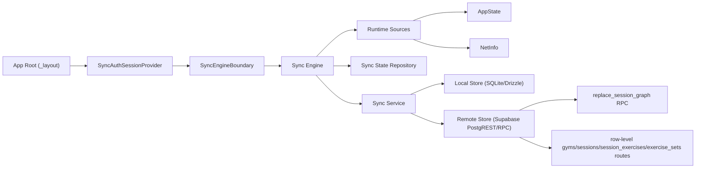

# Mobile Sync Engine Overview

## Purpose

Document the implemented M11 mobile sync architecture in one place so future work can reason about the current system without reconstructing it from task cards and source files.

Scope:

- mobile-side sync only,
- current M11 sync domain only (`gyms`, `sessions`, `session_exercises`, `exercise_sets`),
- current implemented behavior as of `2026-03-03`.

This is a deep dive that complements the high-level architecture summary in `docs/specs/03-technical-architecture.md`.

## 1. Overall architecture

### System view

### Main components

1. `SyncEngineBoundary`
   Mounts sync into the app lifecycle from the root React tree.

2. `createSyncEngine`
   Orchestrates when sync runs.
   Responsibilities:
   - evaluate auth/backend eligibility,
   - listen to lifecycle/connectivity changes,
   - run periodic polling,
   - serialize sync attempts,
   - persist sync-state transitions,
   - apply retry backoff.

3. `createSyncService`
   Orchestrates one sync pass across the current domain.
   Responsibilities:
   - load a full local dataset snapshot,
   - load a full remote dataset snapshot,
   - compare local vs remote records,
   - push newer local state,
   - pull newer remote state,
   - resolve session-graph stale-write conflicts deterministically.

4. `createSyncLocalStore`
   Adapts SQLite/Drizzle data into sync-friendly domain objects and applies pulled remote state back into the local database.

5. `createSyncRemoteStore`
   Adapts Supabase `PostgREST` table routes and the aggregate `replace_session_graph` RPC into the same sync domain objects used locally.

6. `createSyncStateRepository`
   Persists operational sync metadata in local SQLite:
   - status,
   - paused reason,
   - last attempted sync,
   - last failed sync,
   - last successful sync.

7. Auth/config/runtime adapters
   These isolate the engine from application and platform details:
   - auth session source,
   - backend env config,
   - `AppState`,
   - `NetInfo`.

### Design shape

The implemented system is not a persisted outbox.

Instead, each eligible foreground sync attempt does full-snapshot reconciliation for the currently scoped M11 domain. That is simpler than an outbox while the domain is still small and while session writes already have strong aggregate protection through the backend RPC.

## 2. Sync strategy

### Trigger model

The engine can attempt sync from five trigger sources:

1. `bootstrap`
   Fired once when the boundary mounts and the engine starts.

2. `resume`
   Fired when the app transitions from a non-active state back to `active`.

3. `connectivity_regain`
   Fired when connectivity transitions from offline to online.

4. `poll`
   Fired on a fixed interval while the app remains open.
   Current default: `60_000 ms`.

5. `auth_change`
   Fired when the injected auth-session source publishes a change.

### Eligibility gates

Before a sync attempt runs, the engine checks:

1. Backend config exists.
   Missing config pauses sync with `backend_unconfigured`.

2. Auth session exists.
   Missing session pauses sync with `auth_missing`.

3. Auth session is not expired.
   Expired session pauses sync with `auth_expired`.

4. Device is online.
   Offline state pauses sync with `offline`.

If any gate fails, local app behavior continues normally. Only sync is paused.

### Attempt lifecycle

Each eligible attempt follows this flow:

1. Persist `status = syncing` and `lastAttemptedSyncAt`.
2. Run one reconciliation pass through `createSyncService`.
3. On success:
   - persist `status = idle`,
   - clear `pausedReason`,
   - persist `lastSuccessfulSyncAt`.
4. On failure:
   - classify the failure,
   - persist `lastFailedSyncAt`,
   - either pause immediately or enter retry backoff.

### Serialization and queuing

Only one sync attempt runs at a time.

If another trigger arrives while a sync is in flight, it is queued and processed after the current attempt completes. This avoids overlapping writes and keeps sync-state updates ordered.

### Retry and backoff

The engine retries only for backend-style failures, not for ineligible states like missing auth or offline.

Current backoff behavior:

- base delay: `5_000 ms`,
- max delay: `60_000 ms`,
- growth: exponential (`base * 2^(attempt-1)`).

During the backoff window:

- ordinary triggers such as `poll` are ignored,
- `connectivity_regain` and `auth_change` bypass the backoff window and can retry immediately.

### Reconciliation model

The service compares full local and remote snapshots for:

1. `gyms`
2. `sessionGraphs`

For each entity id, it applies deterministic rules.

#### Gyms

1. Local exists, remote missing:
   push local gym with `createGym`.

2. Remote exists, local missing:
   pull remote gym into SQLite.

3. Both exist, local `updatedAt` is newer:
   push local gym with `updateGym`.

4. Both exist, remote is same timestamp or newer but payload differs:
   pull remote gym into SQLite.

This means equal timestamps do not trigger a merge. The remote copy wins if the payloads differ and local is not strictly newer.

#### Session graphs

Session sync is aggregate-oriented. A session plus all nested exercises and sets are treated as one unit.

Rules:

1. Local graph exists, remote missing:
   push local graph through `replace_session_graph` with `expectedUpdatedAt = null`.

2. Remote graph exists, local missing:
   replace the local graph with the remote aggregate.

3. Both exist, local `updatedAt` is newer:
   push local graph through `replace_session_graph` with `expectedUpdatedAt = remote.updatedAt`.

4. Both exist, remote is same timestamp or newer but payload differs:
   replace the local graph with the remote aggregate.

### Conflict and stale-write handling

Session conflicts are handled at the aggregate level, not by merging child rows.

When a local graph is newer and the backend rejects the push with `SESSION_GRAPH_STALE`:

1. The client re-reads the latest remote graph for that session.
2. If the remote graph is missing:
   retry create/push with `expectedUpdatedAt = null`.
3. If the remote graph `updatedAt` is newer than or equal to the local graph:
   pull remote and replace local.
4. If the local graph is still newer than the freshly re-read remote graph:
   retry one more push with the fresher remote `updatedAt`.

This preserves the aggregate invariant:

- never mix child rows from divergent versions,
- always end with one complete authoritative session graph.

### Local replacement semantics

Pulled or resolved remote session graphs are written back into SQLite by replacing:

1. the parent `sessions` row,
2. all child `session_exercises`,
3. all child `exercise_sets`.

This matches the recorder’s own aggregate-write model and keeps local parity with the backend aggregate contract.

### Error categories and resulting engine state

| Error / condition | Engine result |
| --- | --- |
| `auth_missing` | pause sync immediately |
| `auth_expired` | pause sync immediately |
| `backend_unconfigured` | pause sync immediately |
| `offline` | pause sync immediately |
| `backend_unavailable` or uncategorized remote failure | persist `error`, enter backoff |
| `session_graph_stale` | handled inside reconciliation path, not surfaced as final engine failure unless resolution fails |

## 3. Integration with the rest of the app

### Main entrypoints

#### App root

`apps/mobile/app/_layout.tsx`

- bootstraps the local data layer,
- wraps the app in `SyncAuthSessionProvider`,
- mounts `SyncEngineBoundary`.

This is the top-level runtime entrypoint for sync.

#### React boundary

`apps/mobile/src/sync/SyncEngineBoundary.tsx`

- reads the current auth-session source from context,
- resolves backend config from env,
- constructs backend/local/state/runtime adapters,
- creates the engine,
- starts it in a `useEffect`,
- stops it on unmount.

This is the composition root for the sync subsystem.

#### Auth integration boundary

`apps/mobile/src/sync/auth-session.tsx`

The rest of the app does not call the engine directly with auth data. Instead, sync consumes an injected `SyncAuthSessionSource`.

That makes sync integration explicit:

- today:
  the app uses a logged-out default source,
- later:
  auth work can swap in a real session source without rewriting engine/service logic.

#### Data integration boundary

`apps/mobile/src/data/sync-state.ts`

This is how sync operational state enters the shared local data layer.

The sync engine depends on this repository to persist status transitions, and future UI surfaces can read the same state for diagnostics.

#### Domain data entrypoints

The sync subsystem reads and writes the same underlying local tables used elsewhere by the app:

- `gyms`,
- `sessions`,
- `session_exercises`,
- `exercise_sets`.

It does not currently go through the session-recorder repository APIs. Instead it uses dedicated sync-local adapters so the synchronization model can work on aggregate snapshots.

### Current integration posture

The sync subsystem is intentionally quiet:

- no route calls it directly,
- no UI currently depends on it to render,
- no local recorder/list/history flow waits for it,
- failure only updates local sync-state metadata.

That keeps sync non-blocking and consistent with the local-first product contract.

## 4. File map

### Sync source files

`apps/mobile/src/sync/index.ts`

- public export surface for the sync subsystem.

`apps/mobile/src/sync/types.ts`

- shared sync domain types:
  - triggers,
  - sync-state shape,
  - dataset and aggregate record shapes,
  - local/remote store contracts.

`apps/mobile/src/sync/error.ts`

- sync-specific error class and error normalization helper.

`apps/mobile/src/sync/auth-session.tsx`

- auth-session abstraction,
- eligibility resolution,
- provider/context for wiring sync into the app tree.

`apps/mobile/src/sync/backend-client.ts`

- thin fetch client for Supabase requests,
- env-based backend config loading,
- schema header wiring,
- anon key + optional bearer token attachment.

`apps/mobile/src/sync/runtime-sources.ts`

- adapters over `AppState` and `NetInfo`,
- normalizes platform runtime signals into sync engine inputs.

`apps/mobile/src/sync/engine.ts`

- foreground orchestration core,
- trigger subscriptions,
- eligibility checks,
- serialization/queueing,
- retry backoff,
- sync-state persistence transitions.

`apps/mobile/src/sync/service.ts`

- one full reconciliation pass,
- local-vs-remote comparison logic,
- push/pull decisions,
- stale session conflict resolution flow.

`apps/mobile/src/sync/local-store.ts`

- SQLite/Drizzle adapter for sync,
- loads the scoped domain into sync dataset objects,
- replaces local aggregates when remote wins.

`apps/mobile/src/sync/remote-store.ts`

- Supabase adapter for sync,
- uses row-level routes for pulls and gym writes,
- uses `replace_session_graph` RPC for aggregate session writes,
- maps remote error payloads into sync error categories.

`apps/mobile/src/sync/SyncEngineBoundary.tsx`

- React composition root that constructs and mounts the engine.

### Closely related non-sync files

`apps/mobile/app/_layout.tsx`

- top-level application integration point for sync.

`apps/mobile/src/data/sync-state.ts`

- repository used by the engine to persist sync operational state.

`apps/mobile/src/data/schema/sync-state.ts`

- SQLite table definition for persisted sync state.

`supabase/session-sync-api-contract.md`

- backend contract reference the remote store depends on.

`supabase/migrations/20260303113000_m11_session_graph_replace_rpc.sql`

- implementation of the aggregate backend write path used for session graphs.

### Current test files

`apps/mobile/app/__tests__/sync-backend-client.test.ts`

- auth eligibility and request header coverage.

`apps/mobile/app/__tests__/sync-state-repository.test.ts`

- persisted sync-state default and patch behavior.

`apps/mobile/app/__tests__/sync-engine.test.ts`

- trigger coverage,
- pause behavior,
- retry/backoff behavior.

`apps/mobile/app/__tests__/sync-service.test.ts`

- reconciliation behavior,
- pull/push decisions,
- stale session conflict resolution.

## Boundaries and current limitations

1. Sync scope is still limited to the current M11 session domain.
2. There is no persisted outbox yet.
3. There is no OS-level background sync.
4. The current user-facing diagnostics surface is intentionally read-only (`/sync-status` plus a compact shared bottom-tab shortcut); there is no manual sync control center yet.
5. Full-snapshot reconciliation is simple and deterministic now, but may need revisiting if domain size grows substantially.

## Recommended reading order

1. `docs/specs/03-technical-architecture.md`
2. this document
3. `supabase/session-sync-api-contract.md`
4. `apps/mobile/src/sync/engine.ts`
5. `apps/mobile/src/sync/service.ts`
